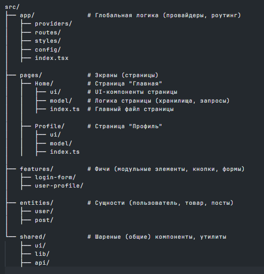

Для запуска приложения на Expo, вам нужно следовать нескольким шагам. Ниже приведена полная инструкция в формате Markdown (MD):

# Инструкция по запуску Expo приложения

Expo — это фреймворк и платформа для разработки кроссплатформенных мобильных приложений на React Native. Следуйте этой инструкции, чтобы запустить ваше Expo приложение.

## Предварительные требования

1. **Установите Node.js**: Убедитесь, что у вас установлен Node.js версии 12 или выше. Вы можете скачать его с [официального сайта](https://nodejs.org/).

2. **Установите Expo CLI**: Expo CLI — это инструмент командной строки для работы с Expo. Установите его глобально с помощью npm:

   ```bash
   npm install -g expo-cli
   ```

## Запуск проекта

1. **Перейдите в директорию проекта**:

   ```bash
   cd League
   ```

2. **Установить зависимости**

   ```bash
   npm install
   ```

3. **Запустите проект**:

   ```bash
   npm start
   ```

````

Эта команда запустит сервер разработки и откроет веб-интерфейс Expo Dev Tools в вашем браузере.

3. **Запустите приложение на устройстве**:

   - **На физическом устройстве**:

     - Установите приложение Expo Go на ваше устройство (доступно в [App Store](https://apps.apple.com/app/expo-go/id982107779) и [Google Play](https://play.google.com/store/apps/details?id=host.exp.exponent&hl=en&gl=US)).
     - Отсканируйте QR-код, который появится в терминале или в веб-интерфейсе Expo Dev Tools, с помощью камеры вашего устройства.

   - **На эмуляторе**:
     - Убедитесь, что у вас установлен Android Studio или Xcode для запуска эмуляторов.
     - В терминале нажмите `a` для запуска на Android эмуляторе или `i` для запуска на iOS симуляторе.

## Предполагаемая архитектура проекта (FSD)



### Слои

- app — точка входа в приложение, настройки, провайдеры.
- pages — страницы и экраны приложения.
- entities — главные бизнес-сущности (например, User, Post).
- features — отдельные функции, которые работают с сущностями (auth, editProfile).
- widgets — более сложные компоненты, собирающие features и entities (Header, ProfileCard).
- shared — общие компоненты, утилиты, хелперы.

```

```
````
